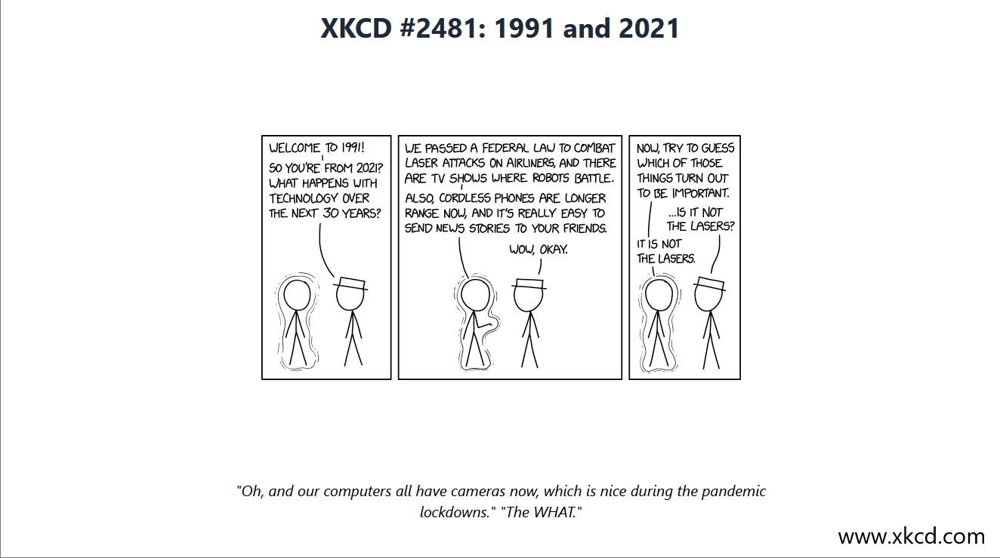

# XKCD Fullscreen Viewer

[](https://choosealicense.com/licenses/mit/)

This is a simple web app displaying comics from the [XKCD](https://xkcd.com/) webcomic in fullscreen mode. It is built with [Next.js](https://nextjs.org/) and [Tailwind CSS](https://tailwindcss.com/).

## How to use

You can use the web app deployed to [Vercel](https://vercel.com/) at [xkcd-fullscreen.vercel.app](https://xkcd-fullscreen.vercel.app/).

By default, it will display a random comic. You can also use the `?id=` query parameter to configure the comic ID directly in the URL.

For example, [xkcd-fullscreen.vercel.app/?id=2481](https://xkcd-fullscreen.vercel.app/?id=2481) will display the comic with the ID 303:


## Development

The easiest way to get started is by launching this repository inside a [dev container](https://containers.dev/).

Install the dependencies:

```bash
bun install
```

Then, run the development server:

```bash
bun dev
```

Open [http://localhost:3000](http://localhost:3000) with your browser to see the result.
